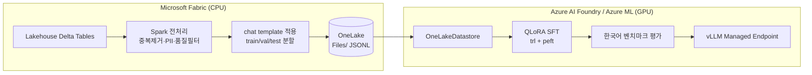

# fabric-foundry-sllm-finetune

**Microsoft Fabric + Azure AI Foundry 를 결합한 한국어 sLLM 파인튜닝 코드 에셋.**

데이터 준비는 Fabric(Spark/OneLake), GPU 학습·배포는 Foundry/Azure ML,
학습 루프는 Hugging Face(`transformers` / `trl` / `peft`) 로 구성됩니다.
**모델은 코드 수정 없이 YAML 설정만으로 교체**할 수 있습니다.

기본 타깃 모델: **`Qwen/Qwen3.8-27B`** (Apache-2.0)

> 상세 설계·리서치 근거는 [`docs/PLAN.md`](docs/PLAN.md) 를 참고하세요.
> 모델/데이터셋 후보 비교, 라이선스 검증, 학습 경로 A/B/C/D, 리스크가 모두 정리되어 있습니다.

---

## 왜 이 에셋이 필요한가

Fabric 과 Foundry 를 **파인튜닝** 관점에서 묶은 공식 Microsoft 샘플이 없습니다.
그래서 실무에서 매번 다음 세 가지를 다시 만듭니다.

1. Fabric Lakehouse(Delta) → 학습용 JSONL 로 내보내는 경로
2. 한국어 데이터셋의 **라이선스 판별** (상당수가 NC/ND 라 상용 학습에 쓸 수 없음)
3. 한국어 벤치마크 평가 파이프라인

이 리포는 이 세 가지를 **설정 파일로 고정**하고, 모델만 갈아끼우면 되게 만듭니다.

### 역할 분담 (중요)

**Fabric Spark 는 CPU 전용이라 GPU 학습이 불가능합니다.** 따라서 이렇게 나눕니다.



> `OneLakeDatastore` (AML SDK v2, Preview) 는 **`Files/` 폴더만** 지원하고
> `Tables/`(Delta) 는 읽지 못합니다. 그래서 Spark 에서 JSONL 로 내보내는 단계가 필수입니다.

---

## 빠른 시작

`uv` 로 관리합니다. (`export PATH="$HOME/.local/bin:$PATH"`)

```bash
uv sync --extra dev          # 개발 의존성 (Azure/GPU 없이 동작)
uv run pytest                # 전체 테스트 (네트워크·과금 없음)
uv run ffsft models list     # 교체 가능한 모델 목록
```

GPU 학습 의존성은 무겁기 때문에 별도 extra 로 분리했습니다.

```bash
uv sync --extra train        # transformers>=5.8, trl, peft, torch, bitsandbytes
uv sync --extra azure        # azure-ai-ml, azure-identity, mlflow
uv sync --extra data         # datasets, huggingface-hub
```

---

## 모델 교체 방법

모든 학습/평가 코드는 모델 ID 를 하드코딩하지 않고 **레지스트리에서 `ModelSpec` 을 조회**합니다.

```bash
uv run ffsft models list                        # 전체
uv run ffsft models list --max-params-b 5       # 5B 이하만
uv run ffsft models list --commercial-only      # 상용 가능 라이선스만
uv run ffsft models list --provider hf
uv run ffsft models show qwen3.8-27b            # 단일 모델 상세
uv run ffsft models trainable                   # 파인튜닝 가능 여부 + 불가 사유
```

새 모델을 추가하려면 [`configs/models.yaml`](configs/models.yaml) 에 항목만 추가하면 됩니다.
**Python 코드 수정은 필요 없습니다.**

```yaml
- key: my-model
  display_name: My Model
  provider: hf                 # hf | foundry_managed | foundry_serverless
                               # | azure_openai | inference_only
  hf_id: org/my-model
  supports: [qlora, lora, full]   # 첫 항목이 기본 레시피
  params_b: 7.0
  license: apache-2.0
  commercial_use: true
  korean_tier: strong             # native | strong | moderate | weak | unknown
  vram_gb: { qlora: 12, lora: 24, full: 120 }
  recommended_sku: Standard_NC24ads_A100_v4
```

다른 레지스트리 파일로 통째로 교체할 수도 있습니다.

```bash
FFSFT_MODEL_REGISTRY=/path/to/my_models.yaml uv run ffsft models list
```

### 현재 등록된 모델 (21개)

| 계열 | 키 | 크기 | 비고 |
|---|---|---|---|
| **Qwen (기본)** | `qwen3.8-27b` ⭐ | 27.8B | Apache-2.0, 기본 타깃 |
| | `qwen3.8-27b-fp8` | 27.8B | FP8 양자화 |
| | `qwen3.6-27b` | 27.8B | 폴백 후보 |
| | `qwen3.5-9b` / `-4b` / `-2b` / `-0.8b` | 0.9~9.7B | 가장 최신 **소형** 티어 |
| **한국어 네이티브** | `midm-2.0-mini` | 2.3B | KT, **MIT** (가장 안전) |
| | `midm-2.0-base` | 11.5B | KT, MIT |
| | `kanana2-3b` / `-1.3b` | 1.3~3.5B | 카카오 |
| | `hyperclovax-seed-1.5b` | 1.6B | 네이버 |
| | `exaone-4.0-1.2b` | 1.3B | LG, 비상용 |
| **Microsoft** | `phi4-mini` | 3.8B | MIT, Foundry 서버리스 튜닝 가능 |
| **Foundry 서버리스** | `foundry-qwen-32b` 외 | - | JSONL 제출형 (블랙박스) |
| **MAI** | `mai-thinking-1`, `mai-ds-r1` | - | **파인튜닝 불가** (아래 참조) |

---

## MAI 모델 검토 결과 (결론: 파인튜닝 불가)

요청하신 Microsoft MAI 자체 모델을 조사한 결과입니다.

- `microsoft/MAI-DS-R1` 이 **유일한 오픈 웨이트** MAI 모델이지만 **671B** (DeepSeek-R1 포스트트레이닝) 로 sLLM 범위를 완전히 벗어납니다.
- `MAI-Thinking-1`, `MAI-Code-1`, `MAI-Image`, `MAI-Voice`, `MAI-Transcribe` 는 모두 **API 전용 독점 모델**로 웨이트가 공개되지 않습니다.
- "Frontier Tuning"(RL 기반 커스터마이징)은 선별 프리뷰이며 Hugging Face 기반이 아닙니다.
- 공개된 **한국어 벤치마크 수치가 없습니다.**

그래서 삭제하지 않고 `provider: inference_only` 로 **레지스트리에 남겨** 두었습니다.
검토 결과가 코드에 근거로 남고, LLM-as-judge / 합성 데이터 생성 용도로는 활용할 수 있습니다.

```bash
uv run ffsft models trainable   # 파인튜닝 불가 모델과 그 사유를 출력
```

> ⚠️ Hugging Face 의 `Tongyi-MAI/*` 는 **알리바바** 조직이며 Microsoft MAI 와 무관합니다.

---

## 한국어 데이터셋 · 벤치마크

라이선스가 이 도메인의 가장 큰 함정입니다. 모든 항목에 `license` / `commercial_use` 를 명시했습니다.

- [`configs/datasets.yaml`](configs/datasets.yaml) — 학습용. 기본 믹스 `ko_commercial_safe` 는 **MIT / Apache-2.0 만** 포함합니다. NC 데이터는 명시적 opt-in 이어야 합니다.
- [`configs/benchmarks.yaml`](configs/benchmarks.yaml) — 평가용. KMMLU, HAE-RAE, IFEval-Ko, LogicKor 등 10종. 기본 스위트는 `ko_core`.

**모든 벤치마크는 `eval_only: true` 로 강제**됩니다. 한국어 벤치마크 상당수가 CC-BY-**ND** / **NC** 라
학습에 쓰면 라이선스 위반인 동시에 테스트셋 오염이 됩니다. 이 불변식은 테스트로 검증합니다.

```python
def test_no_benchmark_id_appears_in_the_training_datasets(): ...
def test_default_mix_contains_only_commercially_safe_datasets(): ...
```

---

## ID 검증

리서치로 얻은 모델/데이터셋 ID 는 **실제로 틀린 경우가 많습니다.**
(예: `Qwen/Qwen3.5-4B-Instruct` 는 존재하지 않음 — 실제 ID 에는 `-Instruct` 접미사가 없습니다.)

그래서 설정 파일의 모든 ID 를 Hugging Face API 로 직접 검증하는 스크립트를 포함했습니다.

```bash
uv run python scripts/verify_hf_ids.py                      # 전체 검증
uv run python scripts/verify_hf_ids.py --models             # 모델만
uv run python scripts/verify_hf_ids.py --spec Qwen/Qwen3.8-27B   # 실제 아키텍처 확인
```

일부 항목(`HAERAE-HUB/qarv-instruct-ko`, `HAERAE-HUB/CLIcK`)은 **게이트 리포**라
접근 권한을 신청해야 하며, 401 은 정상입니다.

---

## Qwen3.8-27B 사용 시 반드시 알아야 할 점

실제 `config.json` 을 확인한 결과, 이름만 보고 넘기면 실패하는 요소가 3가지 있습니다.

1. **멀티모달 체크포인트입니다.** `Qwen3_5ForConditionalGeneration` 이며 vision/video 토큰을 가집니다.
   한국어 텍스트 전용 SFT 에서는 `language_model_only: true` 로 비전 타워를 로드/학습하지 않아야 합니다.
2. **하이브리드 아키텍처입니다.** 64 레이어 중 4번째마다 full attention, 나머지는 linear/SSM 계열입니다.
   → **QLoRA(bitsandbytes 4-bit)가 이 레이어들과 호환되는지는 아직 검증되지 않았고, 본 프로젝트 최대 리스크입니다.**
   실패 시 폴백은 `qwen3.6-27b` 또는 `qwen3.5-9b` 입니다.
3. **`transformers>=5.8` 이 필수**입니다. (`transformers_version: 5.8.0.dev0`)

또한 vocab 이 **248,320** 토큰(Qwen3 는 152K)이라 한글 토크나이징 효율이 크게 개선됩니다.

### VRAM 추정치 (27.8B 기준)

| 방식 | 추정 peak VRAM | 권장 SKU |
|---|---|---|
| QLoRA 4-bit ⭐ | ~26 GB | `Standard_NC24ads_A100_v4` (1×A100 80GB) |
| BF16 LoRA | ~76 GB | 2×80GB 권장 (여유 없음) |
| Full FT | ~460 GB | `Standard_ND96isr_H100_v5` (8×H100) + ZeRO-3 |

> 계산 추정치이며 실측값이 아닙니다.
> **A100/H100 쿼터는 기본 0인 경우가 많으니 몇 주 전에 증설 신청하세요.**

---

## 프로젝트 구조

```
configs/            # 교체 지점: 모델·데이터셋·벤치마크 레지스트리
  models.yaml
  datasets.yaml
  benchmarks.yaml
src/ffsft/
  models/           # ModelSpec + 레지스트리 (구현 완료)
  data/             # 데이터 로딩 · 라이선스 게이팅
  fabric/           # OneLake / Lakehouse 연동
  train/            # 백엔드: local | aml | foundry_serverless | aoai
  eval/             # 한국어 벤치마크
  deploy/           # vLLM Managed Online Endpoint
  cli.py            # ffsft CLI
notebooks/fabric/   # Fabric Spark 데이터 준비 노트북
scripts/            # verify_hf_ids.py 등 유틸
docs/PLAN.md        # 전체 설계 문서 (리서치 근거 포함)
tests/
```

## 현재 상태

- [x] 리서치 (Qwen 계열 / 한국어 데이터셋·벤치마크 / Fabric·Foundry / MAI)
- [x] 모든 HF ID 실제 API 검증
- [x] 모델 추상화 레이어 + 레지스트리 + CLI
- [x] 3종 설정 레지스트리 (모델·데이터셋·벤치마크)
- [x] 설계 문서 `docs/PLAN.md`
- [ ] Fabric Spark 데이터 준비 노트북
- [ ] `src/ffsft/data` 로더 (라이선스 게이팅 포함)
- [ ] `src/ffsft/train` 백엔드 4종
- [ ] Qwen3.8-27B QLoRA 호환성 실검증 ← **최우선 리스크**
- [ ] 한국어 벤치마크 평가 · 배포

## 사전 요구사항

- Azure 구독 + **Foundry User / Foundry Owner** 롤
  (2025~26년에 `Azure AI User` → `Foundry User` 로 이름이 변경되었습니다.)
- Azure ML 워크스페이스 + **A100/H100 쿼터**
- Microsoft Fabric 워크스페이스 + Lakehouse
  (자동화용 서비스 주체는 워크스페이스 **Viewer** 롤 필요)
- 인증 스코프: Foundry/AML 은 `https://ai.azure.com/.default`,
  **OneLake 는 `https://storage.azure.com/.default`** (Storage 오디언스)

## 라이선스

MIT (본 리포 코드 기준). 각 모델·데이터셋은 **개별 라이선스를 따릅니다** —
`configs/*.yaml` 의 `license` / `commercial_use` 필드를 반드시 확인하세요.
