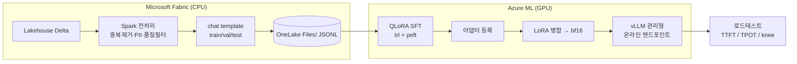

# fabric-foundry-sllm-finetune

**한국어 sLLM 파인튜닝 + vLLM 서빙 핸즈온 워크샵.**

Microsoft Fabric 에서 데이터를 만들고, Azure ML 에서 QLoRA 로 파인튜닝하고,
병합한 가중치를 vLLM 커스텀 이미지로 **관리형 온라인 엔드포인트**에 올려
TTFT/TPOT 를 재는 것까지 — 한 리포에서 끝까지 돕니다.

기본 타깃 모델: **`Qwen/Qwen3.8-27B`** (Apache-2.0).
**모델은 코드 수정 없이 YAML 만 바꿔서 교체**합니다.

---

## 실측 기준선

이 리포의 숫자는 전부 라이브 Azure 구독에서 잰 것입니다. 근거는 `docs/JOURNAL.md` 절 번호.
**전체 로드테스트 결과·그래프·원자료는 [`docs/PERFORMANCE.md`](docs/PERFORMANCE.md)** 에 있습니다.

| 항목 | 실측값 | 근거 |
|---|---|---|
| 27B QLoRA 학습 (30스텝, seq 1024, 유효배치 16) | **41.6분**, `train_loss 1.2637` | §20 |
| 학습 VRAM 피크 | **28.19 GB** → 40 GB GPU 필요 | §20, §35 |
| 학습 파라미터 | 116.73M (**0.79%**) | §20 |
| 관리형 엔드포인트 서빙 (A100 1대, thinking OFF) | **peak 189 tok/s**, knee=16, p95 TTFT 1.32초 | §66 |
| 같은 부하, 베이스 모델 대조군 | peak 204 tok/s, **TPOT 는 동일** (0.0407초) | §66.2 |
| tok/s 격차 223토큰의 출처 | **프롬프트 1개** — 나머지는 `max_tokens` 상한에 눌림 | §70 |
| 로드테스트 성공률 | **200/200, 실패 0** (2배포 × 5레벨 × 20요청) | §66 |
| 출력 토큰 원가 (knee 기준) | **$7.29 / 100만 토큰** | [PERFORMANCE §7](docs/PERFORMANCE.md) |
| 사고 토큰 스트림 | SSE 4921 프레임 중 4920 이 `reasoning` 필드 | §68 |
| 3개 게이트 (학습 → 배포 → 로드테스트) | 전부 통과 | §66 |

---

## 워크샵 한 판은 명령 두 줄 사이에 있습니다

```bash
uv run ffsft infra up   --prefix <본인> --location <region>   # Lab 0 — 열기
...
uv run ffsft infra down --prefix <본인> --yes                 # Lab 7 — 닫기
```

**참가자 한 명 = 리소스 그룹 하나 = 리전 하나 = 셸 하나.** 이름은 prefix 하나만 정하면
나머지(워크스페이스·스토리지·ACR·KeyVault)가 전부 거기서 나옵니다. Lab 이 그룹을 더
만드는 일은 없습니다 — 그룹이 청구 경계이자 삭제 단위라서, 하나면 `infra down` 한 줄로
워크샵이 통째로 사라집니다. 고객 구독에서 열고 닫는 것이 이 워크샵의 전제입니다.

---

## 두 개의 트랙 — 하나만 골라도 됩니다

```
Lab 0  환경 준비 ─────────────────────────────────────────── 공통, 필수
   │
   ├── Track A: 파인튜닝              ├── Track B: vLLM on Azure ML
   │   Lab 1  데이터 준비 (Fabric)    │   Lab 4  vLLM 서빙 이미지 빌드
   │   Lab 2  QLoRA 학습 (A100)       │   Lab 5  관리형 엔드포인트 배포
   │   Lab 3  평가 (base vs tuned)    │   Lab 6  로드테스트 + 토큰 뷰어
   │                                  │
   └───────────────┬──────────────────┘
                   │   A·B 를 둘 다 했으면 (풀사이클)
                   ▼
              Lab 8  풀사이클 — 어댑터 병합 → blue/green → 트래픽 전환
                   │
                   │   Track B 만 했으면 Lab 6 에서 여기로 바로
                   ▼
              Lab 7  내리기 (비용 누수 스캔) — 어느 트랙이든 맨 마지막
```

> ⚠️ **Lab 8 이 Lab 7 보다 먼저입니다 — 번호 순서가 아닙니다.**
> Lab 8 은 Lab 5 가 띄운 `blue` 옆에 green 을 올려 트래픽을 넘기는 실습입니다.
> Lab 7 로 먼저 내리면 그 `blue` 가 없어서 24분짜리 배포부터 다시 해야 하고,
> $4.959/시 × 24분 ≈ **$2** 를 산출물 없이 다시 냅니다
> ([lab7.md](docs/labs/lab7.md) 순서표, [lab8.md](docs/labs/lab8.md) 순서).

**Track B 는 학습 없이 단독으로 됩니다.** Lab 5 에서 `--hf-model` 로 HF 허브 모델을
바로 띄우면 GPU 학습 잡을 한 번도 안 돌리고 vLLM 배포·로드테스트를 끝까지 실습합니다.

| 하고 싶은 것 | 읽을 Lab | 대략 소요 | GPU 필요 |
|---|---|---|---|
| 파인튜닝만 | 0 → 1 → 2 → 3 → **7** | 2~3시간 | 학습용 A100 |
| vLLM 배포만 | 0 → 4 → 5 → 6 → **7** | 2시간 | 서빙용 A100 |
| 풀사이클 | 0 → 1 → 2 → 3 → 4 → 5 → 6 → **8 → 7** | 하루 | 둘 다 |

👉 **[`docs/labs/lab0.md`](docs/labs/lab0.md) 부터 시작하세요.**

> ⚠️ **모든 Lab 은 정리 단계로 끝납니다.** 관리형 엔드포인트는 놀고 있어도 정가로
> 과금됩니다 (NV36 기준 ~$103/일). Lab 을 중간에 그만두더라도
> `uv run ffsft lifecycle down --all --yes` 는 반드시 실행하세요.
>
> **그건 미터를 멈추는 것이지 그룹을 비우는 것이 아닙니다.** 워크스페이스·스토리지·
> ACR·KeyVault 는 그대로 남습니다. 끝났으면 `uv run ffsft infra down --prefix <본인> --yes`
> ([Lab 7 §7](docs/labs/lab7.md)).

---

## 5분 안에 확인 — Azure 없이

GPU 도 Azure 구독도 없이 서빙 절반이 전부 돕니다.

```bash
export PATH="$HOME/.local/bin:$PATH"
uv sync --extra dev
uv run pytest                         # 1232 passed, 2 skipped, ~9s, 네트워크·Azure 접근 없음
uv run ffsft models list --commercial-only
uv run ffsft models show qwen3.8-27b
```

서빙 절반을 **가중치 없이** 끝까지 돌려봅니다. 목 서버는 실서버와 같은 방식으로
SSE 를 흘리고 사고 토큰을 `delta.reasoning` 에 싣습니다.

```bash
uv run python scripts/mock_vllm_server.py &          # 127.0.0.1:8111
uv run ffsft loadtest --base-url http://127.0.0.1:8111/v1 --model ffsft
# -> TTFT / TPOT / p50-p95-p99 / knee point
```

실제 가중치로 CPU 추론까지 보려면 (모델을 내려받습니다):

```bash
uv run ffsft serve-local --model Qwen/Qwen3.5-0.8B   # 작은 모델로 충분합니다
```

---

## 돈을 쓰기 전에 돌릴 무료 점검

```bash
uv run python scripts/verify_hf_ids.py               # configs/ 의 모든 hf_id 를 HF API 로
uv run python scripts/probe_architecture.py qwen3.8-27b --check   # 선언 vs 실제 LoRA 타깃
uv run ffsft deploy check --probe                    # 실제 create 호출, min=0, 즉시 삭제
```

셋 다 불일치면 non-zero 로 끝나므로 CI 게이트로 쓸 수 있습니다.
`probe_architecture.py` 는 meta 디바이스에 올리므로 **가중치를 내려받지 않습니다**.

---

## 아키텍처 한 장



**Fabric Spark 는 CPU 전용이라 GPU 학습을 못 합니다.** 그래서 데이터는 Fabric,
학습·서빙은 Azure ML 로 나뉩니다. `OneLakeDatastore` 는 **`Files/` 만** 지원하고
`Tables/`(Delta) 는 못 읽어서, Spark 에서 JSONL 로 내보내는 단계가 필수입니다.

설계 근거와 대안 비교는 [`docs/design/PLAN.md`](docs/design/PLAN.md).

---

## 모델 교체

코드를 고치지 않습니다. `configs/models.yaml` 에 한 항목을 추가합니다.

```yaml
models:
  - key: my-model
    display_name: My Model
    provider: hf
    hf_id: org/model-name
    supports: [qlora, lora]
    params_b: 8.0
    context_length: 131072
    license: apache-2.0
    commercial_use: true
    vram_gb: {qlora: 12, lora: 24, full: 140}
    recommended_sku: Standard_NC24ads_A100_v4
    lora_target_modules: [q_proj, k_proj, v_proj, o_proj, gate_proj, up_proj, down_proj]
```

> **하이브리드 어텐션 모델은 `lora_target_modules` 를 반드시 선언해야 합니다.**
> PEFT 기본값은 Qwen3.5/3.6/3.8 의 4개 중 1개 레이어에만 존재해서, 선언을 빠뜨리면
> **오류 없이 대부분의 레이어가 학습되지 않습니다.** 이 리포는 추측하는 대신 거부합니다.
> → [GOTCHAS #6](docs/GOTCHAS.md#6)

등록된 모델 목록은 `uv run ffsft models list`.

---

## 문서 지도

| 문서 | 언제 읽나 |
|---|---|
| [`docs/labs/`](docs/labs/) | **실습. 여기부터.** lab0 ~ lab8 |
| [`docs/GOTCHAS.md`](docs/GOTCHAS.md) | **막혔을 때.** 실제로 밟은 함정 18개 |
| [`docs/PERFORMANCE.md`](docs/PERFORMANCE.md) | **내 숫자가 맞나.** 성능 평가 — 그래프 5장 + 원자료 JSON |
| [`docs/RUNBOOK.md`](docs/RUNBOOK.md) | 손으로 올리고 내리는 절차 |
| [`docs/SERVING.md`](docs/SERVING.md) | 서빙 패턴 레퍼런스 |
| [`docs/design/PLAN.md`](docs/design/PLAN.md) | 왜 이렇게 설계했나 |
| [`docs/JOURNAL.md`](docs/JOURNAL.md) | 어떤 숫자를 무엇으로 재서 얻었나. **실험 노트이고 철회된 절이 있다** |
| [`CLAUDE.md`](CLAUDE.md) | 이 리포에서 코드를 고칠 때 |

---

## 사전 요구사항

- Azure 구독 + **Foundry User / Foundry Owner** 롤
  (2025~26년에 `Azure AI User` → `Foundry User` 로 이름이 변경되었습니다)
- Azure ML 워크스페이스 + **A100 쿼터** — 단, 쿼터만으로는 부족합니다.
  리전 `restrictions` 와 `supportedComputeTypes` 를 함께 확인하세요 → [GOTCHAS #2, #3](docs/GOTCHAS.md#2)
- Microsoft Fabric 워크스페이스 + Lakehouse (Track A 만)
  (자동화용 서비스 주체는 워크스페이스 **Viewer** 롤 필요)
- 인증 스코프: Foundry/AML 은 `https://ai.azure.com/.default`,
  **OneLake 는 `https://storage.azure.com/.default`** (Storage 오디언스)
- `uv` (설치 위치 `~/.local/bin` 이 기본 PATH 에 없습니다)

## 서브트리 워크플로

`notebooks/fabric` 은 위성 리포로 동기화되는 **git subtree** 입니다.
여기서 편집하고 저기로 push 하세요. 반대 방향은 `subtree pull --squash` 없이 하지 마세요.

```bash
git remote add fabric <satellite-repo-url>                          # 최초 1회
git subtree push --prefix=notebooks/fabric fabric main              # 이 리포 → 위성
git subtree pull --prefix=notebooks/fabric fabric main --squash     # 위성 → 이 리포
```

## 라이선스

MIT (본 리포 코드 기준). 각 모델·데이터셋은 **개별 라이선스를 따릅니다** —
`configs/*.yaml` 의 `license` / `commercial_use` 필드를 반드시 확인하세요.
