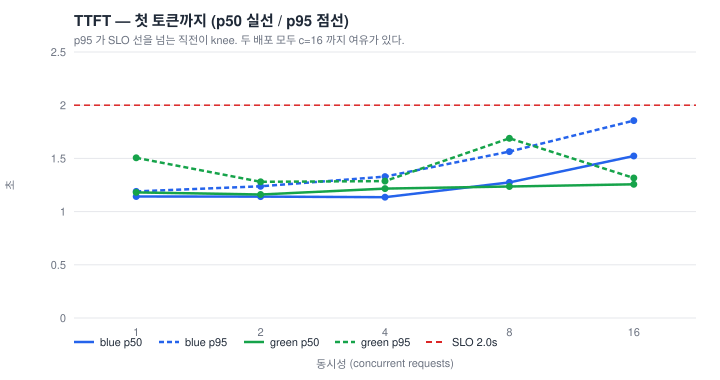
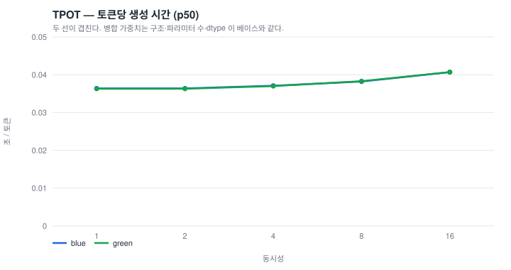
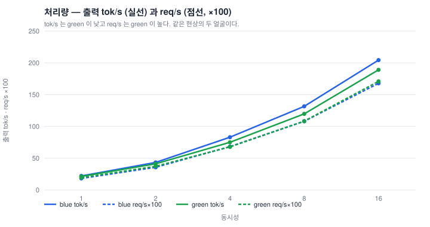
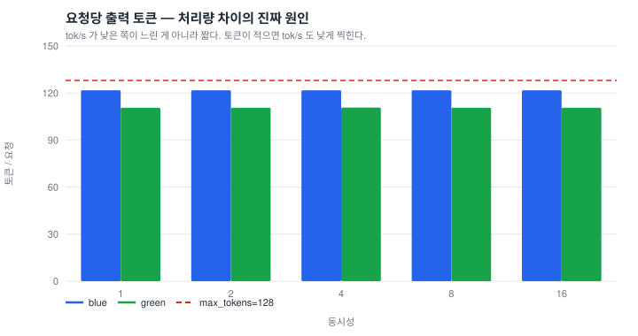
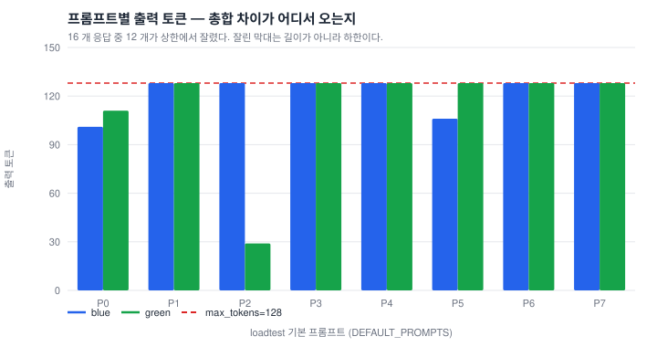

# 성능 평가 — 기준 회차

이 워크샵의 모든 숫자는 **라이브 Azure 구독에서 실제로 잰 값**입니다. 추정치도,
벤더 자료 인용도 없습니다. 원자료와 그래프는 [`docs/results/`](results/) 에 그대로
있고, 과정과 오독 이력은 [`docs/JOURNAL.md`](JOURNAL.md) 절 번호로 연결됩니다.

> **단, 요율은 예외입니다.** 성능 수치는 polandcentral 에서 잰 것이고, 달러로 바꾸는
> 요율은 **koreacentral 로 조회**한 값입니다. 두 리전의 미터가 같은지는 확인 안 했습니다
> — §1 의 첫 ⚠️ 를 읽으세요.

> 각 Lab 의 "기대 출력" 은 이 문서의 값을 잘라 붙인 것입니다. **여러분의 숫자가
> ±20% 안이면 정상**입니다. 크게 벗어나면 [GOTCHAS](GOTCHAS.md) 를 먼저 보세요.

**한 줄 요약:** A100 80GB 한 장에 27B 를 올려 **p95 TTFT 2초 안에서 동시성 16,
189~204 tok/s, 200요청 실패 0**. 파인튜닝 전후로 **토큰당 생성 시간은 동일**하고,
집계 tok/s 차이는 속도가 아니라 **응답 길이** 차이입니다 (§6).

---

## 1. 측정 환경

| 축 | 값 |
|---|---|
| 리전 | **polandcentral** — 이 회차가 실제로 돈 곳 (koreacentral 은 A100 존 제한, §52 / §57) |
| 서빙 SKU | `Standard_NC24ads_A100_v4` · **1 인스턴스** · A100 80GB |
| 서빙 이미지 | `vllm/vllm-openai` 기반 커스텀 (`docker/Dockerfile.serve`) |
| 모델 | `Qwen/Qwen3.8-27B` 27B bf16 |
| `max_model_len` | 8192 |
| 학습 SKU | 같은 SKU, **LowPriority** |
| 시간당 비용 | 서빙 $4.959/시 (PAYG) · 학습 LowPriority **$0.992/시** — 둘 다 **koreacentral 요율**, 아래 ⚠️ 를 먼저 읽으세요 |

> ### ⚠️ 잰 곳은 polandcentral, 요율은 koreacentral — **같은 미터인지 확인 안 했습니다**
> 위 표의 `리전` 줄과 `시간당 비용` 줄은 **출처가 다릅니다.** 섞어 읽으면 안 됩니다.
>
> - **회차가 돈 리전 — polandcentral.** 학습·병합·배포·로드테스트 전부 여기서 났습니다.
> - **요율을 조회한 리전 — koreacentral.** PAYG $4.959 는 `SKU_HOURLY_PAYG`
>   (Retail Prices API · koreacentral · Consumption, §71.2), LowPriority $0.992 는
>   §72.1 의 표(koreacentral · Linux · Consumption, 2026-08-27 조회). 두 값 다
>   **koreacentral 로만** 기록돼 있습니다.
> - **polandcentral 요율은 이 리포가 조회한 적이 없습니다.** 두 리전이 같은 미터를
>   쓴다는 확인도 없습니다. 안 쟀으므로 같다고도, 다르다고도 적지 않습니다.
> - 그래서 이 문서의 달러 값은 전부 **"polandcentral 회차를 koreacentral 요율로 환산한
>   값"** 입니다. §7 의 100만 토큰당 원가, [Lab 8](labs/lab8.md) 의 79분 비용표도
>   같은 환산 위에 서 있습니다. **polandcentral 청구서가 아닙니다.**
> - **닫는 방법**: Retail Prices API 를 `armRegionName eq 'polandcentral'` ·
>   `type eq 'Consumption'` 로 조회해 위 두 값과 대조하고 JOURNAL 에 새 절로 적으세요.
>   행 고르기 함정 셋(Reservation·DevTest·`Linux` 문자열)은 §72.1 에 그대로 있습니다.
>   조회 전까지 이 문단을 지우지 마세요.

> ### ⚠️ $0.992/시 는 **요율**이고, §23.5 의 "약 $1.5" 는 **잡 1회 총액**입니다
> 이 문서의 이전 판은 이 칸에 **"학습 LowPriority 약 $1.5/시"** 라고 적었습니다.
> **$1.5 는 요율로 잰 적이 없습니다** — §23.5 가 잡 하나의 총 요금으로 적은 값이고,
> [Lab 2](labs/lab2.md) 는 처음부터 "잡 1회 실측이지 요율이 아닙니다" 라고 쓰고
> 있었습니다. 이 문서가 랩과 어긋나 있었던 것이고, **철회합니다** (§72.4).
>
> - **요율 $0.992/시** — `Standard_NC24ads_A100_v4` LowPriority. Azure Retail Prices
>   API, koreacentral, Linux, Consumption, 2026-08-27 조회 (§72.1). PAYG $4.959 의 0.20 배.
> - **두 값은 맞춰지지 않습니다.** 학습 구간 42.3분(§23.1)에 요율을 곱하면 **$0.70**,
>   §23.5 의 실측 총액은 **약 $1.5**. 차액 약 $0.8 이 무엇인지 **이 리포는 모릅니다** —
>   그 잡은 학습만 한 게 아니라 54 GB 다운로드와 27B 2회 적재·채점을 같은 노드에서
>   했고, **잡 전체의 노드 점유 시간이 어디에도 기록돼 있지 않습니다.** 42.3분은
>   학습 구간의 벽시계일 뿐입니다.
> - 그래서 **$1.5 ÷ 0.705시간 = $2.13/시 로 되돌리지 마세요.** 그건 요율이 아니라
>   잡 하나의 오버헤드까지 요율로 착각한 값입니다.
> - 이 요율은 **학습 클러스터에만** 씁니다. 관리형 온라인 엔드포인트는 LowPriority 를
>   쓸 수 없으므로 서빙 줄은 PAYG $4.959 그대로입니다 (§71.2).

**배포 두 개를 같은 엔드포인트에 나란히 두고** 같은 부하를 걸었습니다.

| | `blue` | `green` |
|---|---|---|
| 가중치 | `Qwen/Qwen3.8-27B` 순정 (HF 허브 직접) | 파인튜닝 → 병합 후 blob 에서 컨테이너가 직접 수신 |
| `REASONING_PARSER` | *(빈 값)* | `qwen3` |
| 역할 | 대조군 | 측정 대상 |

두 배포는 **같은 SKU, 같은 인스턴스 수, 같은 이미지**입니다. 다른 것은 가중치와
파서 설정뿐이므로, 아래 차이는 전부 그 둘 중 하나로 설명되어야 합니다.

---

## 2. 로드테스트 — 전체 결과

부하 파라미터: `max_tokens=128`, `temperature=0.0`, `enable_thinking=false`,
동시성 1→2→4→8→16, **각 레벨 20요청**, TTFT SLO 2.0초.

### 2.1 `blue` — 베이스 27B

원자료: [`results/loadtest-blue-base.json`](results/loadtest-blue-base.json)

| conc | ok | fail | TTFT p50 | TTFT p95 | TTFT p99 | TPOT p50 | e2e p50 | e2e p95 | tok/s | req/s | wall |
|---:|---:|---:|---:|---:|---:|---:|---:|---:|---:|---:|---:|
| 1 | 20 | 0 | 1.142 | 1.190 | 1.358 | 0.0364 | 5.723 | 5.779 | 22.04 | 0.181 | 110.5s |
| 2 | 20 | 0 | 1.141 | 1.238 | 1.244 | 0.0364 | 5.729 | 5.813 | 43.36 | 0.356 | 56.2s |
| 4 | 20 | 0 | 1.136 | 1.329 | 1.329 | 0.0371 | 5.795 | 6.055 | 82.97 | 0.682 | 29.3s |
| 8 | 20 | 0 | 1.275 | 1.563 | 2.132 | 0.0382 | 6.093 | 6.364 | 131.60 | 1.081 | 18.5s |
| **16** | 20 | 0 | 1.523 | **1.855** | 1.869 | 0.0407 | 6.695 | 6.987 | **204.29** | 1.678 | 11.9s |

`knee = 16` · `peak = 204.29 tok/s` · **100/100 성공, 실패 0**

### 2.2 `green` — 파인튜닝 + 병합 27B

원자료: [`results/loadtest-green-tuned.json`](results/loadtest-green-tuned.json)

| conc | ok | fail | TTFT p50 | TTFT p95 | TTFT p99 | TPOT p50 | e2e p50 | e2e p95 | tok/s | req/s | wall |
|---:|---:|---:|---:|---:|---:|---:|---:|---:|---:|---:|---:|
| 1 | 20 | 0 | 1.181 | 1.505 | 1.930 | 0.0363 | 5.753 | 6.031 | 21.29 | 0.193 | 103.9s |
| 2 | 20 | 0 | 1.161 | 1.280 | 1.733 | 0.0363 | 5.745 | 5.839 | 41.12 | 0.372 | 53.8s |
| 4 | 20 | 0 | 1.216 | 1.286 | 1.287 | 0.0370 | 5.878 | 5.976 | 75.02 | 0.678 | 29.5s |
| 8 | 20 | 0 | 1.236 | 1.689 | 1.868 | 0.0383 | 6.014 | 6.555 | 119.75 | 1.083 | 18.5s |
| **16** | 20 | 0 | 1.257 | **1.315** | 1.317 | 0.0407 | 6.448 | 6.471 | **189.01** | 1.709 | 11.7s |

`knee = 16` · `peak = 189.01 tok/s` · **100/100 성공, 실패 0**

---

## 3. 지연 — TTFT (첫 토큰까지)



- **p95 TTFT 2.0초 SLO 를 만족하는 최대 동시성은 16** — 양쪽 다. 동시성을 16배로
  올려도 p95 가 1.190 → 1.855초(blue), 1.505 → 1.315초(green) 입니다.
- 그래프에서 **곡선이 SLO 선을 뚫는 지점 직전이 knee** 입니다. 이 회차는 16 까지
  재고 멈췄으므로 knee 는 "**최소** 16" 으로 읽는 게 정확합니다 — 32 에서 뚫렸을지
  안 뚫렸을지는 재지 않았습니다.
- **동시성 8 에서 blue 의 TTFT p99 가 2.132초로 SLO 를 넘습니다** (p95 는 1.563).
  그래프의 p95 선에는 안 보이는 꼬리입니다. 표의 p99 열을 같이 보세요.
- green 의 p50 이 c=1 에서 blue 보다 높고 c=16 에서 낮은 것은 **20요청 표본의
  흔들림**입니다. 이 폭(±0.3초)은 유의미한 차이로 읽지 마세요.

---

## 4. 지연 — TPOT (토큰당 생성 시간)



**두 선이 겹칩니다.** 5개 레벨 전부에서 소수점 넷째 자리까지 같거나 0.0001 차이입니다.

| conc | 1 | 2 | 4 | 8 | 16 |
|---|---:|---:|---:|---:|---:|
| blue | 0.0364 | 0.0364 | 0.0371 | 0.0382 | **0.0407** |
| green | 0.0363 | 0.0363 | 0.0370 | 0.0383 | **0.0407** |

이건 우연이 아니라 **당연한 결과**입니다. LoRA 를 병합한 가중치는 베이스와
아키텍처·파라미터 수·dtype 이 전부 같습니다. 텐서 값만 바뀌었으므로 토큰 하나를
만드는 연산량이 달라질 이유가 없습니다. **이 그래프가 안 겹치면 파인튜닝이 아니라
다른 것(양자화, SKU, `max_model_len`, 배치 설정)이 바뀐 것입니다.**

> **파인튜닝은 서빙 속도를 바꾸지 않습니다.** 바꾸는 것은 모델이 무슨 말을
> 얼마나 하느냐이고, 그건 §6 입니다.

동시성을 16배 올리는 동안 TPOT 는 **12% 만** 나빠졌습니다 (0.0364 → 0.0407).
연속 배칭(continuous batching)이 의도대로 동작한다는 뜻입니다.

---

## 5. 처리량



동시성 1 → 16 에서 처리량 **9.3배** (22.0 → 204.3 tok/s). TPOT 가 12% 나빠지는
대가로 얻는 것입니다. 이 곡선이 선형에 가깝게 안 올라가면 배칭이 꺼진 것입니다.

그래프에서 **tok/s(실선)는 blue 가 위, req/s(점선)는 green 이 위**입니다.
둘이 반대 방향을 가리키는 것이 다음 절의 출발점입니다.

---

## 6. ⚠️ tok/s 로 두 배포를 비교하면 오독합니다 (§66.2, §70)

peak tok/s 가 **204.3 → 189.0, 7.5% 낮습니다.** 이걸 "파인튜닝이 서빙을 느리게
만들었다" 로 적으면 **틀립니다.**

| conc | tok/req blue | tok/req green | TPOT blue | TPOT green | req/s blue | req/s green |
|---:|---:|---:|---:|---:|---:|---:|
| 1 | 121.8 | 110.6 | 0.0364 | 0.0363 | 0.181 | **0.193** |
| 2 | 121.8 | 110.6 | 0.0364 | 0.0363 | 0.356 | **0.372** |
| 4 | 121.8 | 110.7 | 0.0371 | 0.0370 | 0.682 | 0.678 |
| 8 | 121.8 | 110.6 | 0.0382 | 0.0383 | 1.081 | **1.083** |
| 16 | 121.8 | 110.6 | 0.0407 | 0.0407 | 1.678 | **1.709** |



- **TPOT 는 같거나 0.0001 차이입니다** (§4). 정확히 일치하는 것은 c=16 뿐이고 나머지
  네 레벨은 0.0001 씩 어긋납니다. 그 어긋남의 부호가 c=8 에서 뒤집히므로(green 이
  c=1·2·4 는 낮고 c=8 은 높음) 방향이 있는 차이가 아니라 표기 자리수의 흔들림입니다.
  토큰 하나 뽑는 비용은 안 변했습니다.
- **차이는 전부 응답 길이입니다.** blue 121.8 tok/req vs green 110.6 — 9.2% 짧습니다.
- 짧으면 요청이 빨리 끝나므로 **req/s 는 올라가고 tok/s 는 내려갑니다.**
  두 지표가 반대로 움직이는 게 아니라, **같은 한 가지 사실의 두 얼굴**입니다.
- **출력 토큰 총합이 5개 레벨에서 동일합니다** (blue 2435, green 2212 — c=4 만
  2214). `temperature=0` 이므로 같은 프롬프트에 같은 답이 나온다는 뜻이고,
  이 재현성이 아래 §6.1 을 가능하게 합니다.

> **tok/s 는 두 배포가 같은 일을 할 때만 비교 가능한 지표입니다.**
> 서빙 속도로 읽어야 할 값은 **TPOT 와 req/s** 입니다.

### 6.1 원인 규명 — 프롬프트 단위로 다시 쟀습니다

집계값은 "왜 짧은지" 를 말해주지 않습니다. 원인은 셋 중 하나이고 셋의 의미가
전부 다릅니다:

| 가능한 원인 | 확인 방법 | 의미 |
|---|---|---|
| ① `max_tokens` 상한에서 잘림 | `finish_reason == "length"` | 측정값은 길이가 아니라 **하한** |
| ② 사고과정이 `content` 에 누출 | 본문에 `<think>` / `reasoning` 필드 | 파서 설정 문제 |
| ③ 진짜로 말을 덜 함 | `finish_reason == "stop"` | 모델 행동 변화 |

로드테스트와 **똑같은 파라미터**(`max_tokens=128`, `temperature=0`,
`enable_thinking=false`)로 8개 기본 프롬프트를 두 배포에 각각 한 번씩 보내고
`finish_reason` 을 봤습니다. 원자료:
[`results/tokens-per-prompt.json`](results/tokens-per-prompt.json)



| # | 프롬프트 | blue | green | 차이 |
|---:|---|---|---|---:|
| P0 | 자기소개 | 101 `stop` | 111 `stop` | −10 |
| P1 | 4대 명절 | 128 `length` | 128 `length` | 0 |
| P2 | 존댓말 변환 | 128 `length` | **29 `stop`** | **+99** |
| P3 | 과적합 설명 | 128 `length` | 128 `length` | 0 |
| P4 | 서울–부산 비교 | 128 `length` | 128 `length` | 0 |
| P5 | 파이썬 함수 | 106 `stop` | 128 `length` | −22 |
| P6 | 전세/월세 표 | 128 `length` | 128 `length` | 0 |
| P7 | '배' 중의성 | 128 `length` | 128 `length` | 0 |
| | **합** | **975** (121.9/req) | **908** (113.5/req) | |

**세 가지가 나왔습니다.**

**① 사고과정 누출은 없었습니다.** 16개 응답 전부 `content` 에 `<think>` 가 없고
`reasoning` 필드도 비어 있었습니다. `enable_thinking=false` 면 템플릿이
`<think>\n\n</think>` 를 미리 채워 넣으므로 사고 블록이 생성되지 않습니다 (§68.4).
이 문서의 이전 판은 여기서 blue 의 사고과정 누출(§66.1)을 원인으로 적었는데,
**§66.1 은 `chat_template_kwargs` 를 안 보낸 조건**(템플릿 기본값, 사고 ON)에서
잰 것이었습니다. **조건이 다른 측정을 옮겨 적은 오류였습니다** (§70 에 철회).

**② 16개 중 12개가 상한에서 잘렸습니다.** 양쪽 다 6/8 입니다. 잘린 응답의 토큰
수는 길이가 아니라 `max_tokens` 그 자체이므로, **집계 평균은 대부분 상한을 재고
있었습니다.**

**③ 격차 전체가 프롬프트 하나에서 나옵니다.** 로드테스트는 20요청을 8개 프롬프트에
라운드로빈으로 돌리므로 P0–P3 가 3번, P4–P7 이 2번 나갑니다. 위 표의 차이에 이
횟수를 곱하면:

```
3×(−10) + 3×0 + 3×(+99) + 3×0 + 2×0 + 2×(−22) + 2×0 + 2×0
  = −30 + 297 − 44 = 223 토큰
```

로드테스트가 기록한 격차는 **2435 − 2212 = 223 토큰**. 정확히 일치합니다.
즉 **+297 을 만든 P2 하나가 전체 격차를 혼자 만들었고**, green 은 P0 와 P5 에서는
오히려 **더 깁니다.**

P2 는 `"다음 문장을 정중한 존댓말로 바꿔줘: '내일 회의 몇시야?'"` 입니다.
blue 는 상황별 변형 4가지를 소제목까지 붙여 나열하다 128 에서 잘렸고, green 은
한 문장으로 답하고 29 토큰에서 스스로 멈췄습니다. 짧은 변환 지시에 짧게 답하는
것은 **개선**으로 볼 만하지만, **프롬프트 1개짜리 관찰**입니다.

> **결론: "파인튜닝이 응답을 9.2% 짧게 만들었다" 는 성립하지 않습니다.**
> 8개 중 1개 프롬프트에서 벌어진 차이가 라운드로빈으로 3배 증폭돼 집계에 찍힌
> 것이고, 나머지는 상한에 눌려 길이를 비교할 수 없는 상태였습니다. 8개를 정확히
> 쪼개면 **양쪽 다 눌림 5, blue 만 눌림 1(P2), green 만 눌림 1(P5), 양쪽 다 스스로
> 멈춤 1(P0)** 입니다. 눌린 쪽의 128 은 길이가 아니라 하한이므로, **두 응답이 모두
> `stop` 이라 길이를 진짜로 비교할 수 있는 프롬프트는 P0 하나뿐이고 거기서는 green 이
> 더 깁니다** (111 vs 101). 격차를 만든 P2 도 blue 쪽이 하한이라 "얼마나 더
> 길었나" 는 여전히 모릅니다. 이 쪼개기의 재도출은 §71.

### 6.2 이 측정의 한계 — 정직하게

- **응답 길이를 비교하려면 `max_tokens` 를 훨씬 크게 잡고 다시 재야 합니다.**
  12/16 이 잘린 측정으로는 길이 분포를 말할 수 없습니다. 이 회차는 처리량을
  재려고 128 로 고정한 것이고, 그 목적에는 맞습니다.
- 레벨당 20요청은 p99 를 논하기에 적은 표본입니다. p50/p95 까지만 읽으세요.
- 프롬프트 8개는 **품질 평가 표본이 아닙니다.** 부하 생성기의 입력일 뿐입니다.
  모델 품질은 [Lab 3 평가](labs/lab3.md)의 base vs tuned 델타로 보세요.
- 단일 인스턴스·단일 리전입니다. 스케일아웃 곡선은 안 쟀습니다.
- `enable_thinking=false` 전용 결과입니다. ON 은 **다른 눈금자**입니다 (§8).

---

## 7. 출력 토큰 원가 환산

peak 처리량을 시간당 요금으로 나눈 값입니다. **상한에 가까운 이론치**이고,
실제 서비스는 동시성이 항상 knee 에 있지 않으므로 이보다 비쌉니다.

| | peak tok/s | 시간당 출력 토큰 | 100만 출력 토큰당 |
|---|---:|---:|---:|
| blue (베이스) | 204.29 | 735,444 | **$6.74** |
| green (파인튜닝) | 189.01 | 680,436 | **$7.29** |

- 기준: `Standard_NC24ads_A100_v4` **$4.959/시**, 1 인스턴스. 요율은 **koreacentral
  조회값**이고 이 회차는 polandcentral 에서 돌았습니다 — §1 의 ⚠️ 참조.
- green 이 토큰당 비싼 것은 **느려서가 아니라 §6 의 집계 효과**입니다. 요청당
  원가로 보면 green 이 더 쌉니다 (req/s 가 높으므로).
- **놀고 있어도 같은 요금이 나갑니다.** 동시성 1 로 쓰면 tok/s 가 22 이므로
  100만 토큰당 $62.5 — knee 대비 **9.3배**입니다. 배칭이 원가의 대부분입니다.
- 이 표가 [Lab 7 정리](labs/lab7.md)를 건너뛰면 안 되는 이유입니다.

---

## 8. 사고 토큰 (thinking ON) 실측 (§68)

로드테스트는 `enable_thinking=false` 로 쟀습니다. **ON 은 다른 눈금자**입니다.

긴 예산 (`max_tokens=6000`) 으로 SSE 를 파싱하지 않고 그대로 받아 델타 키를 셌습니다:

| 측정 | 값 |
|---|---|
| SSE 프레임 수 | 4921 |
| delta 키 분포 | `{'role': 1, 'reasoning': 4920}` |
| `reasoning_content` 프레임 | **0개** |

정상 예산 (`max_tokens=200`, 짧은 질문) 으로 다시 재면:

| 측정 | 값 |
|---|---|
| 사고 델타 | 37개, 82자, **첫 델타까지 1.04초** |
| 답 델타 | 26개, 57자, 첫 델타까지 2.42초 |
| 종료 | `finish=stop` — 스스로 끝냄 |
| `usage` | `prompt_tokens 62 / completion_tokens 65` |
| thinking ON 시 템플릿이 주입하는 시스템 프롬프트 | **40 토큰** |

`content` 첫 글자까지 **12.94초**가 걸린 회차도 있습니다 — 사고가 길면 그만큼
`content` 가 늦습니다. **TTFT 를 잴 때 어느 필드의 첫 델타인지 정해두지 않으면
같은 요청이 1.04초로도, 12.94초로도 기록됩니다** (§67 이 그렇게 틀렸습니다).

- **사고 델타의 필드명은 `reasoning` 입니다.** `reasoning_content` 가 아닙니다.
  이 오타 하나로 "thinking 이 고장났다" 는 잘못된 결론을 한 번 냈습니다 (§67 → §68).
- ON 이면 프롬프트가 40토큰 늘고 완성 토큰이 수천 단위로 늘 수 있습니다.
  **ON/OFF 를 섞어 비교하면 안 됩니다.** §6.1 의 오류가 정확히 이것이었습니다.

---

## 9. 사이클 나머지 구간의 실측 소요

| 구간 | 실측 | 근거 |
|---|---|---|
| 27B QLoRA 학습 (30스텝, seq 1024, 유효배치 16) | **41.6분**, `train_loss 1.2637` | §20 |
| 학습 VRAM 피크 | **28.19 GB** → 40GB 이상 GPU 필요 | §20, §35 |
| 학습 파라미터 | 116.73M (전체의 **0.79%**) | §20 |
| LoRA 병합 잡 | **12분 53초** | §66 |
| 병합 가중치 blob → 컨테이너 수신 | 21 blob **50.1 GiB 를 111초** | §64.5 |
| 배포 준비 완료 (`Succeeded`) | **24분** | §66 |
| 배포 readiness 예산 | `PT2M + 45×PT15S` = **13.25분** | §64 |

- **수신 111초 vs 예산 13.25분** — 여유는 있지만 blob 이 다른 리전이면 이 여유가
  사라집니다. 가중치와 엔드포인트는 같은 리전에 두세요.

---

## 10. 3개 게이트 (§66)

| 게이트 | 결과 | 무엇으로 증명했나 |
|---|---|---|
| 1. 학습 | 통과 | 병합 산출물을 **별도 잡**이 blob 에서 마운트해 종료 코드로 검증 (39초, exit 0) |
| 2. 배포 | 통과 | green `Succeeded` + **응답 본문**으로 검증 — 200 OK 아님 |
| 3. 로드테스트 | 통과 | 엔드포인트 URL 에 100요청 × 2배포, **실패 0** |

**게이트 2 가 200 OK 였다면 blue 도 통과했을 것입니다.** `verify_deployment.sh` 는
`chat_template_kwargs` 를 **보내지 않으므로** 템플릿 기본값(사고 ON)으로 호출되고,
파서가 없는 blue 는 영어 사고과정을 `content` 에 380자 쏟아낸 뒤 200 을 돌려줍니다.
`ffsft.serve.smoke` 가 본문을 읽기 때문에 잡혔습니다 (§66.1).

> 같은 두 배포가 게이트 2(사고 ON)에서는 크게 다르고 로드테스트(사고 OFF)에서는
> 사고 블록이 아예 안 나옵니다. **어느 조건에서 잰 값인지 안 적으면 §6.1 처럼
> 틀립니다.**

---

## 11. 재현

```bash
# 1) 엔드포인트가 서빙되는지 (트래픽 안 건드림)
uv run bash scripts/verify_deployment.sh <endpoint> blue green

# 2) 로드테스트 — 위 표와 같은 파라미터
#    `-g/-w` 를 빼면 `az` 는 `az configure --defaults` 를 보는데, 이 워크샵은 그걸
#    설정한 적이 없습니다.
BASE="$(az ml online-endpoint show -n <endpoint> \
        -g "$FFSFT_RESOURCE_GROUP" -w "$FFSFT_WORKSPACE" \
        --query scoring_uri -o tsv)"
uv run ffsft loadtest \
   --base-url "${BASE%/chat/completions}" \
   --model ffsft \
   --concurrency 1,2,4,8,16 \
   --requests-per-level 20 \
   --max-tokens 128 \
   --ttft-slo 2.0 \
   --output my-loadtest.json

# 3) 그래프 — 위 SVG 를 그대로 다시 그립니다 (matplotlib 불필요)
uv run ffsft plot mine=my-loadtest.json --out-dir docs/results

# 4) tok/s 차이가 보이면, 그게 길이인지 속도인지 먼저 확인 (§6.1)
uv run python scripts/compare_deployments.py \
   --base-url "${BASE%/chat/completions}" \
   --deployment blue --deployment green \
   --max-tokens 128 --output tokens-per-prompt.json
uv run ffsft plot --prompts tokens-per-prompt.json --out-dir docs/results
```

- `--api-key` 기본값은 `$FFSFT_ENDPOINT_KEY` 입니다. **키를 명령줄에 적지 마세요.**
  그 변수를 채우는 방법은 [Lab 6 §1](labs/lab6.md) 의 키 획득 단계에 한 번만 적혀
  있습니다 — 여기 다시 붙이지 않는 이유는 두 벌이 갈라지기 때문입니다.
  `verify_deployment.sh` 와 `run_token_viewer.sh` 는 **자기가 직접** 키를 가져오므로,
  그 둘이 돌았다고 이 변수가 실려 있는 것은 아닙니다.
- Azure 없이 계량기만 확인: `scripts/mock_vllm_server.py` 로 같은 명령을 돌립니다
  ([Lab 6 §0](labs/lab6.md)). 성능 숫자는 의미 없고 **파서 검증용**입니다.
- 끝나면 [Lab 7](labs/lab7.md). 안 내리면 계속 과금됩니다.

---

## 12. 원자료

| 파일 | 내용 |
|---|---|
| [`results/loadtest-blue-base.json`](results/loadtest-blue-base.json) | blue 5레벨 전체, `ffsft loadtest --output` 산출물 그대로 |
| [`results/loadtest-green-tuned.json`](results/loadtest-green-tuned.json) | green 5레벨 전체, 같은 형식 |
| [`results/tokens-per-prompt.json`](results/tokens-per-prompt.json) | §6.1 프롬프트별 비교, 응답 본문 포함 |
| [`results/*.svg`](results/) | 위 그래프 5장. `ffsft plot` 이 위 JSON 에서 생성 |

로드테스트 JSON 두 개에 가한 편집은 **`base_url` 의 호스트명을 플레이스홀더로 바꾼
것 하나**뿐입니다. 측정값은 손대지 않았습니다.

§2.1·§2.2 의 모든 셀은 위 JSON 에서 **CLI 와 같은 포맷**(`%.3f` / `%.4f`,
`ffsft/serve/loadtest.py::format_table`)으로 다시 뽑은 것입니다. **손으로 옮겨 적으면
안 됩니다** — 이전 판은 다섯 칸이 반올림 방향 때문에 어긋나 있었고, 그중
`blue c=8` 의 TTFT p95 는 [Lab 6](labs/lab6.md) 이 잘라 간 `1.563` 과 이 문서의
`1.564` 가 **서로 다른 값**이었습니다 (§72.3). SVG 는 손으로 만들지 않았고 JSON 에서
생성되므로, 원자료를 고치면 그래프가 따라 바뀝니다.

---

## 13. `ffsft lifecycle status` 실측 출력 — 유휴 워크스페이스

각 Lab 의 "기대 출력" 은 **이 문서에서 잘라 갑니다.** 그런데 이 문서에는 `status`
출력이 **한 줄도** 없었습니다. 그래서 Lab 들의 `status` 기대 출력은 잘라 온 것이
아니라 **손으로 옮겨 적은 것**이었고, `(low_priority)` 를 `(lowpriority)` 로 적어 둔
네 자리가 그 대가입니다 — 코드를 읽고 고쳤다는 판까지 틀렸고, **실제 Azure 실행
한 번**이 잡을 때까지 아무도 못 봤습니다. 아래가 그 구멍을 메우는 실측입니다.

**언제·어디서:** 2026-08-27, 이 회차의 라이브 워크스페이스 `mlw-ffsft` /
`rg-ffsft-kc`. Azure 접근 권한이 있는 사람이 화면 그대로 캡처했습니다.

**가한 편집은 구독 id 를 `<your-subscription-id>` 로 가린 것 하나**뿐입니다. 공백
한 칸도 손대지 않았습니다. **첫 줄이 비어 있는 것도 그대로**입니다 —
`format_inventory` 가 표 위에 빈 줄을 먼저 찍습니다. 지우지 마세요.

**이 캡처가 증명하는 세계 상태는 하나뿐입니다.**

| 축 | 이 캡처가 실제로 본 것 |
|---|---|
| 컴퓨트 | 유휴 클러스터 `gpu-a100-lp` **하나** (`min_instances=0`, LowPriority 티어) |
| 온라인 엔드포인트 | **없음** — `!!` 줄도 `?` 요율도 없습니다 |
| `LEFTOVERS` | 블록 자체가 **없음** — 리소스그룹 ARM 스캔이 성공했고 고아가 0 이었습니다 |
| 합계 줄 | `BILLING NOW: nothing` |

```

LOOKED IN: workspace mlw-ffsft   resource group rg-ffsft-kc
           subscription <your-subscription-id>
           that triple is what get_ml_client sends, and it scopes every row that came back
           through it. LEFTOVERS does not: it is a separate ARM scan of resource group rg-ffsft-kc,
           same subscription, no workspace. FFSFT_LOCATION=koreacentral is sent by neither, so it
           does not scope this read and cannot explain a missing resource.

KIND                 NAME                               SKU                            $/hr  NOTE
------------------------------------------------------------------------------------------------------------------------------------
  compute-cluster    gpu-a100-lp                        Standard_NC24ads_A100_v4          -  min_instances=0 (low_priority): idle costs nothing
------------------------------------------------------------------------------------------------------------------------------------
BILLING NOW: nothing. No always-on compute in this workspace.
```

`NOTE` 칸의 철자는 `low_priority` 입니다 — **밑줄이 있습니다.** SDK 가 스네이크
케이스로 돌려주고 `lifecycle.py` 는 `(getattr(compute, "tier", "") or
"dedicated").lower()` 로 그대로 내려보냅니다. `LowPriority` 를 가정하고 `.lower()` 를
머릿속으로 돌리면 `lowpriority` 가 나오는데, **그렇게 추론한 판이 틀린 판이었습니다.**

**다른 상태로 늘려 쓰면 안 됩니다.** 엔드포인트가 살아 있는 화면(`!!` 줄, `?` 요율),
`down` 을 돌린 **뒤**의 화면, 고아 디스크가 남은 화면은 **여기서 잰 적이 없습니다.**
그런 자리의 기대 출력은 그 상태를 실제로 잰 캡처가 이 문서에 들어온 뒤에 갱신합니다.
그 전까지 구판 블록에는 "재측정 안 됨" 배너를 답니다 — 상태가 다른 캡처를 갖다 붙이는
것은 잘라 오는 게 아니라 **지어내는 것**이고, 지어낸 기대 출력은 없는 것보다 나쁩니다
(§12 의 "손으로 옮겨 적으면 안 됩니다" 와 같은 규칙입니다).

여기서 잘라 간 자리는 두 곳이고, 둘 다 위 표와 **같은 상태**를 설명하는 자리입니다:
[Lab 0 "기대 최종 상태"](labs/lab0.md), [Lab 7 §2](labs/lab7.md).
